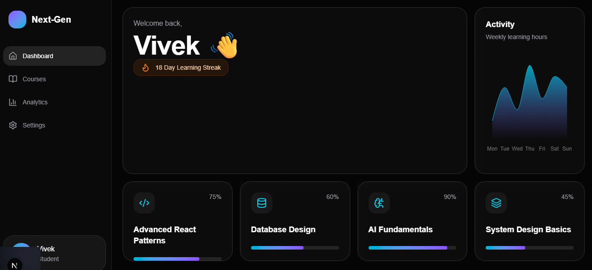

# Student-dashboard

# Next-Gen Learning Dashboard

A futuristic, animated student dashboard built with Next.js, Supabase, Tailwind CSS, and Framer Motion.

Designed with a premium Bento Grid UI, smooth GPU-accelerated animations, dynamic data fetching, responsive layouts, and modern SaaS-inspired interactions.

---

# ✨ Features

## 🎨 Modern UI/UX

-> Futuristic dark-mode dashboard
-> Bento Grid layout
-> Glassmorphism cards
-> Dynamic hover glow tracking
-> Grain/noise texture overlay
-> Smooth Framer Motion animations
-> Responsive design for desktop, tablet, and mobile

---

## ⚡ Animations & Interactions

-> Staggered page entrance animations
-> Spring-based hover effects
-> Shared layout animations
-> Animated progress bars
-> Interactive mobile bottom navbar
-> Cursor-follow glow effects
-> Shimmer loading

---

## 🗄️ Supabase Integration

-> PostgreSQL database
-> Dynamic course fetching
-> Dynamic user profile & learning streak
-> Real activity chart data
-> Secure environment variables

---

## 📊 Dashboard Components

-> Hero greeting section
-> Learning streak indicator
-> Dynamic course cards
-> Weekly activity chart
-> Sidebar navigation
-> Mobile navigation

---

## 🛠️ Performance & Architecture

-> Next.js App Router
-> Server Components
-> Skeleton loading states
-> Error boundaries
-> Modular reusable components
-> TypeScript support
-> Zero layout-shift animations

---

# 🧰 Tech Stack

| Technology    | Purpose            |
| ------------- | ------------------ |
| Next.js 15    | React Framework    |
| TypeScript    | Type Safety        |
| Tailwind CSS  | Styling            |
| Framer Motion | Animations         |
| Supabase      | Backend & Database |
| Recharts      | Activity Charts    |
| Lucide React  | Icons              |

---

# 📁 Project Structure

```bash
student-dashboard/
│
├── app/
│   ├── layout.tsx
│   ├── page.tsx
│   ├── loading.tsx
│   ├── error.tsx
│   └── globals.css
│
├── components/
│   ├── animations/
│   ├── cards/
│   ├── layout/
│   └── ui/
│
├── lib/
│   ├── supabase/
│   └── icon-map.ts
│
├── types/
│   └── course.ts
│
├── public/
│   └── noise.svg
│
└── README.md
```

---

# ⚙️ Installation & Setup

## 1️⃣ Clone Repository

```bash
git clone https://github.com/vivek8271/student-dashboard.git
```

---

## 2️⃣ Navigate Into Project

```bash
cd student-dashboard
```

---

## 3️⃣ Install Dependencies

```bash
npm install
```

---

# 🔑 Environment Variables

Create a `.env.local` file in the root directory.

```env
NEXT_PUBLIC_SUPABASE_URL=YOUR_SUPABASE_URL
NEXT_PUBLIC_SUPABASE_ANON_KEY=YOUR_SUPABASE_ANON_KEY
```

---

# 🗄️ Supabase Database Setup

## Courses Table

```sql
create table courses (
  id uuid primary key default gen_random_uuid(),
  title text not null,
  progress integer not null,
  icon_name text not null,
  created_at timestamp default now()
);
```

---

## Profile Table

```sql
create table profile (
  id uuid primary key default gen_random_uuid(),
  name text not null,
  streak integer not null default 0,
  created_at timestamp default now()
);
```

---

## Activity Table

```sql
create table activity (
  id uuid primary key default gen_random_uuid(),
  day text not null,
  hours integer not null
);
```

---

# 🌱 Seed Mock Data

## Courses

```sql
insert into courses (title, progress, icon_name)
values
('Advanced React Patterns', 75, 'Code2'),
('Database Design', 60, 'Database'),
('AI Fundamentals', 90, 'BrainCircuit'),
('System Design Basics', 45, 'Layers3');
```

---

## Profile

```sql
insert into profile (name, streak)
values ('Vivek', 18);
```

---

## Activity

```sql
insert into activity (day, hours)
values
('Mon', 2),
('Tue', 5),
('Wed', 3),
('Thu', 7),
('Fri', 4),
('Sat', 6),
('Sun', 5);
```

---

# ▶️ Run Development Server

```bash
npm run dev
```

Open:

```txt
http://localhost:3000
```

---

# 📱 Responsive Design

| Device  | Layout                             |
| ------- | ---------------------------------- |
| Desktop | Sidebar + 4-column Bento Grid      |
| Tablet  | Collapsed Sidebar + 2-column Grid  |
| Mobile  | Bottom Navigation + Stacked Layout |

---

# 🎯 Key Learning Outcomes

This project demonstrates:

-> Modern React architecture
-> Server-side data fetching
-> Responsive dashboard engineering
-> Framer Motion proficiency
-> Production-grade UI/UX patterns
-> Component modularity
-> Type-safe frontend development

---

# 🚀 Deployment

Recommended deployment platform:

->> Vercel

Deploy instantly by connecting your GitHub repository.

Deployed URL:
->> ```txt
        https://next-zen-student-dashboard.vercel.app
      ```

---

# 📸 Screenshots



---

# 👨‍💻 Author

**Vivek**

Frontend Developer & Student

---

# 📄 License

This project is for educational and internship assessment purposes.